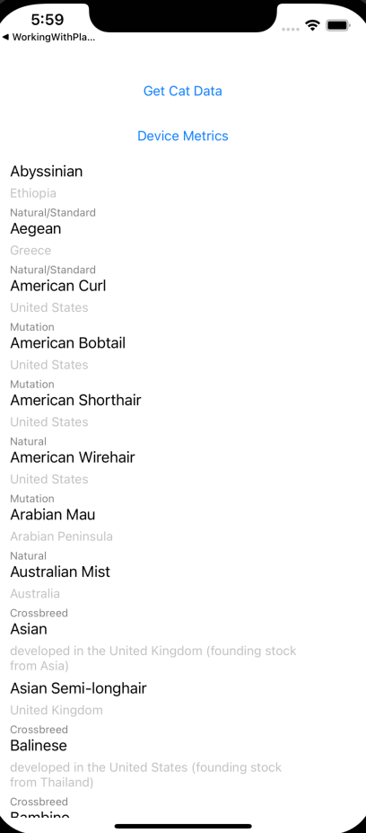
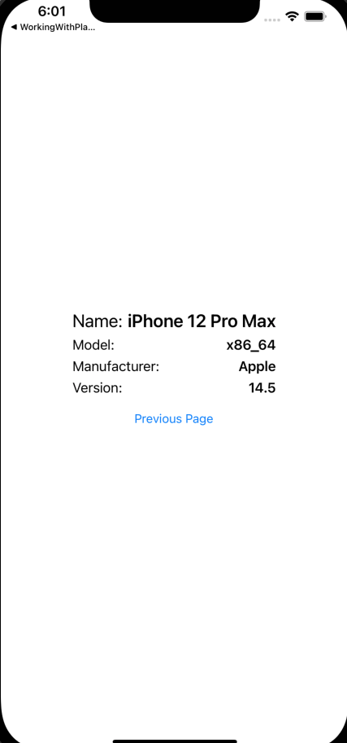
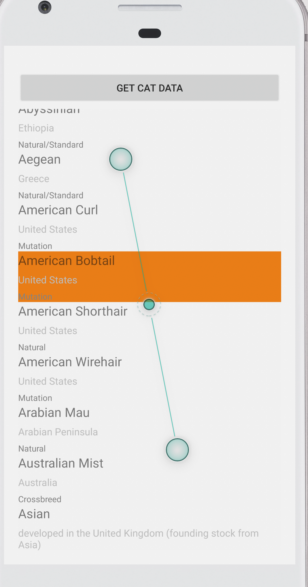

# CatFactsNinja

Xamarin app to demonstrate a simple network call to the cat facts API endpoint. Displays the response using Xamarin forms

To build and run the app:

* Open the CatFactsNinja.sln solution project in Visual Studio. Make sure, you have iOS and Android SDK's and simulators setup.
* Select CatFactsNinja.iOS option next to the play button, click on play (run and build), the app will rrun on the iOS simlator of your choice (You can also run it from the iOS project as well)
* Select CatFactsNinja.Android option next to the play button, click on play (run and build), the app will rrun on the Android simlator of your choice (You can also run it from the Android project as well)
* If you build from the command line, please use msbuild (or xbuild if you are on an earlier version of Xamarin)

### The App has 2 buttons on the main page, one to fetch cat breeds that can be linked to the details and another button to get the Device Metrics.

##### Screenshot of CatFactsNinja app on iOS

##### Screenshot of Metrics deails page on iOS

##### Screenshot of CatFactsNinja app on Android

